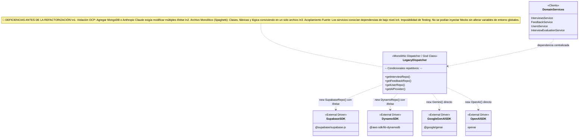
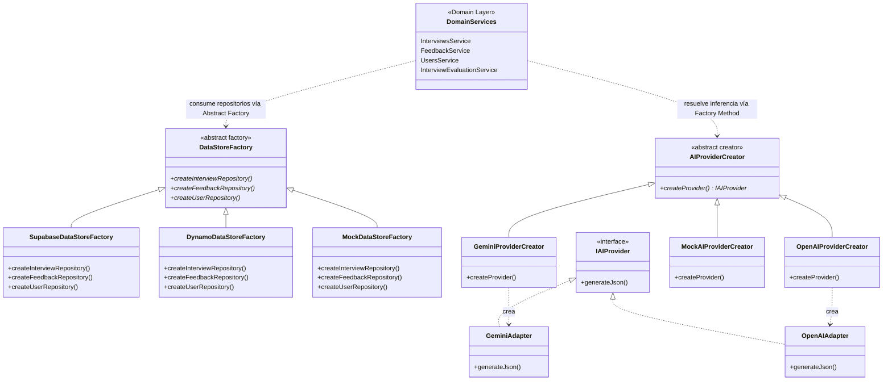

# DevCareer AI

> **Plataforma de Entrenamiento y Preparación Técnica para Desarrolladores de Software**  
> *Proyecto Integrador: Universidad Popular del Cesar*  
> *Asignatura: Patrones de Diseño de Software* 

---

## 📌 Descripción General

**DevCareer AI** es una plataforma integral orientada a la preparación técnica de profesionales en tecnología para procesos de selección y entrevistas laborales. Integra simulaciones de entrevistas de voz en tiempo real con Inteligencia Artificial, análisis y optimización de currículums bajo estándares ATS (*Applicant Tracking Systems*), y entornos interactivos para la resolución y evaluación de retos de código algorítmico y código limpio.

La plataforma está diseñada bajo una arquitectura limpia y altamente modular basada en **Patrones de Diseño GoF** y **Principios SOLID**, garantizando desacoplamiento de infraestructura, extensibilidad y alta testabilidad.

---

## 🔄 Comparativa de Arquitectura: Antes vs. Después

### 1. Estado Inicial (Antes de la Implementación de Patrones)
En las etapas tempranas del proyecto, la arquitectura presentaba acoplamientos fuertes hacia tecnologías concretas y antipatrones de diseño comunes en aplicaciones monolíticas:



#### Antipatrones Identificados:
* **Hardcoded Fallbacks & Shotgun Surgery:** Lógica condicional `if (process.env.SUPABASE_URL)` esparcida en controladores y servicios. Modificar una regla de persistencia requería cambios en múltiples archivos a la vez.
* **Tight Coupling (Alto Acoplamiento):** Dependencia directa de SDKs de terceros (`@google/genai`, `@supabase/supabase-js`, `@aws-sdk/client-dynamodb`).
* **Fat/Monolithic Files:** Clases de persistencia y fábricas agrupadas en un solo archivo de cientos de líneas sin separación por responsabilidad.
* **Testabilidad Nula sin Infraestructura:** No existía forma de ejecutar pruebas unitarias rápidas sin conexión a internet y credenciales activas en la nube.

---

### 2. Estado Refactorizado (Después: Clean Architecture + Patrones GoF)
Se implementaron patrones creacionales, estructurales y de comportamiento, separando cada abstracción y fábrica en su propio archivo modular:



---

### 3. Matriz Comparativa: Antes vs. Después

| Criterio / Aspecto | Antes (Código Legado) | Después (Patrones GoF + SOLID) | Beneficio Obtenido |
| :--- | :--- | :--- | :--- |
| **Persistencia Políglota** | Condicionales `if/else` en cada método para decidir entre Supabase o DynamoDB. | **Abstract Factory:** [DataStoreFactory](Backend/src/repositories/factories/datastore.factory.ts) con fábricas concretas independientes. | Garantía de consistencia de familia y cero condicionales en los servicios. |
| **Proveedores de IA** | Acoplamiento rígido al SDK de Gemini en un solo archivo de 350+ líneas. | **Factory Method + Adapter:** [AIProviderCreator](Backend/src/services/ai/creators/ai-provider.creator.ts) con adaptadores para Gemini y OpenAI GPT-4o. | Capacidad de alternar proveedores de IA con 1 variable o inyección en runtime. |
| **Organización de Código (SRP)** | Clases abstractas, concretas y despachadores mezclados en archivos únicos. | **Modularidad Estricta:** Un archivo por clase dentro de `factories/` y `creators/`. | Eliminación de código espagueti y fácil navegación del código. |
| **Segregación de Interfaces (ISP)** | Servicios atados a implementaciones con dependencias pesadas. | Interfaces segregadas por entidad ([IInterviewRepository](Backend/src/repositories/interview.repository.ts), [IFeedbackRepository](Backend/src/repositories/feedback.repository.ts), [IUserRepository](Backend/src/repositories/user.repository.ts)). | Los servicios solo conocen y dependen de los métodos que realmente utilizan. |
| **Pruebas Unitarias (Testing)** | Requería base de datos real y conexión activa a internet. | Fábricas simuladas ([MockDataStoreFactory](Backend/src/repositories/factories/mock-datastore.factory.ts), [MockAIProviderCreator](Backend/src/services/ai/creators/mock-ai-provider.creator.ts)). | Pruebas unitarias 100% aisladas, sin costo de API y en milisegundos. |
| **Principio Abierto/Cerrado (OCP)** | Agregar una nueva base de datos exigía editar múltiples archivos existentes. | Se crea una nueva subclase sin tocar una sola línea del código existente. | Arquitectura escalable y resistente a regresiones. |

---

## 🚀 Funcionalidades Principales

### 1. Entrevistas de Voz en Tiempo Real con IA
* **Simulación Conversacional:** Conversación bidireccional por voz con agentes de IA a través de WebRTC de ultra baja latencia.
* **Modalidades de Creación:**
  * *Basada en Formulario:* Selección de rol objetivo, nivel de experiencia (*Junior, Mid, Senior, Lead*), stack tecnológico, enfoque de la entrevista (*Técnica, Conductual o Mixta*) y cantidad de preguntas.
  * *Basada en Voz:* Agente conversacional que recopila los parámetros del usuario interactivamente y configura la entrevista.
* **Retroalimentación Multidimensional:** Al finalizar la llamada, el proveedor de IA procesa la transcripción completa generando un informe de desempeño con puntuación global (0-100), evaluación por 5 categorías (*Comunicación, Conocimiento Técnico, Resolución de Problemas, Ajuste Cultural y Claridad*), fortalezas, áreas de mejora y dictamen final.
* **Evaluación de Nivel de Inglés (CEFR):** En entrevistas en inglés, genera en paralelo un reporte de competencia lingüística según el Marco Común Europeo (A1 a C2), con detección de errores gramaticales textuales y sugerencias de vocabulario técnico.
* **Personalidades e Idiomas:** Soporte en Español e Inglés con voces masculinas y femeninas (Alejandro, Catalina, Katie, Daniel).

### 2. Creador y Optimizador de CV (CV Creator)
* Asistente inteligente para la redacción de currículums estructurados bajo estándares internacionales de la industria tecnológica.
* Optimización de titulares profesionales (*headlines*), viñetas de logros laborales mediante verbos de acción fuertes y traducción integral del perfil.

### 3. Analizador de Hojas de Vida ATS (CV Analyzer)
* Procesamiento multimodal de archivos PDF o texto plano contrastados contra descripciones de ofertas de empleo reales.
* Cálculo de índice de compatibilidad ATS (0-100%), desglose de palabras clave coincidentes y faltantes, y sugerencias accionables de formato, impacto y gramática.

### 4. Evaluador de Retos de Programación (Code Challenge)
* Entorno de desarrollo integrado en el navegador basado en **Monaco Editor**.
* Ejecución de pruebas unitarias en tiempo real y evaluación técnica con IA sobre corrección algorítmica, complejidad temporal y espacial Big-O, y adherencia a principios de diseño limpio.

### 5. Portal de Empleos y Postulación Inteligente (En Construcción)
* **Exploración de Vacantes:** Directorio de ofertas de trabajo en tecnología con filtros por rol, nivel de experiencia, stack tecnológico, ubicación y modalidad remota.
* **Postulación Inteligente (1-Click Application):** Autocompletado asistido de formularios de postulación a partir de la información estructurada del perfil y el CV del candidato.
* **Cartas de Presentación con IA:** Generación automatizada de cartas de presentación (*Cover Letters*) personalizadas y alineadas a los requisitos de cada oferta.
* **Simulación de Entrevista por Vacante:** Capacidad de generar y lanzar instantáneamente una entrevista de voz simulada con IA enfocada en los requerimientos específicos de la oferta laboral seleccionada.
* **Índice de Compatibilidad:** Cálculo porcentual de ajuste entre el perfil del desarrollador y la vacante (*Puntaje de Compatibilidad*), identificando fortalezas y brechas técnicas antes de postularse.

### 6. Autenticación y Seguridad Híbrida
* Soporte nativo para inicio de sesión, registro y rutas protegidas.
* Compatible con **AWS Cognito** (User Pools + JWT) en producción y **Supabase Auth** (PostgreSQL) en desarrollo local.

---

## 🧩 Patrones de Diseño de Software Implementados (GoF & Arquitectura)

El sistema incorpora de manera formal y desacoplada los siguientes patrones de diseño:

### 1. Abstract Factory (Creacional - GoF)
* **Ubicación:** `Backend/src/repositories/factories/` y `Backend/src/repositories/repository.factory.ts`
* **Propósito:** Proporciona una interfaz formal para crear familias completas de repositorios de persistencia sin acoplar los servicios de dominio a motores concretos de base de datos.
* **Componentes:**
  * **Fábrica Abstracta Base:** `DataStoreFactory` (`createInterviewRepository()`, `createFeedbackRepository()`, `createUserRepository()`).
  * **Fábrica Concreta 1:** `SupabaseDataStoreFactory` (instancia la familia completa para PostgreSQL / Supabase).
  * **Fábrica Concreta 2:** `DynamoDataStoreFactory` (instancia la familia completa para AWS DynamoDB).
  * **Fábrica Concreta 3:** `MockDataStoreFactory` (instancia repositorios en memoria para pruebas unitarias sin dependencias externas).
  * **Registry / Despachador:** `RepositoryFactory` (administra la inyección y selección dinámica de la fábrica activa).
* **Modularización:** Cada fábrica concreta y la base abstracta residen en su propio archivo independiente respetando SRP.

---

### 2. Factory Method (Creacional - GoF)
* **Ubicación:** `Backend/src/services/ai/creators/` y `Backend/src/services/ai/ai-provider.factory.ts`
* **Propósito:** Define una clase base creadora que delega la instanciación de proveedores de Inteligencia Artificial (`IAIProvider`) a subclases especializadas, permitiendo alternar entre modelos sin alterar los servicios de dominio.
* **Componentes:**
  * **Creador Abstracto Base:** `AIProviderCreator` (declara el método de fábrica `createProvider(): IAIProvider`).
  * **Creador Concreto 1:** `GeminiProviderCreator` (instancia `GeminiAdapter` con `gemini-2.5-flash-lite`).
  * **Creador Concreto 2:** `OpenAIProviderCreator` (instancia `OpenAIAdapter` con `gpt-4o-mini`).
  * **Creador Concreto 3:** `MockAIProviderCreator` (instancia respuestas simuladas para testing y ejecución offline).
  * **Registry / Selector:** `AIProviderFactory` (resuelve el proveedor activo según la variable de entorno `AI_PROVIDER` o inyección explícita).

---

### 3. Adapter Pattern (Estructural - GoF)
* **Ubicación:** `Backend/src/services/ai/gemini.adapter.ts` y `Backend/src/services/ai/openai.adapter.ts`
* **Propósito:** Convierte y homogeniza las interfaces incompatibles de los SDKs de Google `@google/genai` y OpenAI `openai` en una interfaz estándar unificada `IAIProvider` consumida por los servicios de negocio (`InterviewEvaluationService`, `CvAnalysisService`, `CodeChallengeService`, etc.).

---

### 4. Strategy Pattern (Comportamiento - GoF)
* **Ubicación:** `livekit-agent/strategies/voice-agent.strategy.ts`
* **Propósito:** Encapsula las configuraciones, prompts de sistema, vocabularios y parámetros acústicos del agente en tiempo real según el idioma seleccionado (`SpanishVoiceStrategy` y `EnglishVoiceStrategy`), desacoplando el orquestador WebRTC de la lógica conversacional.

---

## 🛠️ Tecnologías Utilizadas

| Capa / Componente | Tecnología | Propósito |
|---|---|---|
| **Frontend Framework** | Next.js 16 (App Router), React 19, TypeScript | Interfaz de usuario reactiva, Server Components y renderizado híbrido |
| **Estilos y Componentes** | Tailwind CSS v4, Framer Motion, Radix UI, shadcn/ui | Sistema de diseño moderno, animaciones y componentes accesibles |
| **Editor de Código** | Monaco Editor (`@monaco-editor/react`) | IDE interactivo para retos de programación en el navegador |
| **Backend API** | Express.js, TypeScript, Node.js 20+ | API REST central, servicios de dominio y control de autenticación |
| **Reconocimiento de Voz (STT)** | Deepgram Nova-2 | Transcripción de voz a texto en tiempo real |
| **Modelo Conversacional (LLM)** | Groq (LLaMA 3.3 70B Versatile) | Razonamiento y diálogo del entrevistador de voz |
| **Síntesis de Audio (TTS)** | Cartesia Sonic-2 | Generación de voz natural de ultra baja latencia |
| **Detección de Actividad Vocal** | Silero VAD | Manejo de turnos de conversación e interrupciones del usuario |
| **Transporte WebRTC** | LiveKit Cloud / LiveKit Agents SDK | Infraestructura de audio en tiempo real y señalización |
| **Inteligencia Artificial de Análisis** | Google Gemini Flash / OpenAI GPT-4o | Generación de preguntas, reportes de feedback, análisis ATS y retos de código |
| **Bases de Datos** | AWS DynamoDB (Producción) / Supabase PostgreSQL (Desarrollo) | Persistencia políglota de usuarios, entrevistas y feedback |
| **Gestión de Identidad** | AWS Cognito User Pools / Supabase Auth | Autenticación y validación de tokens JWT |
| **Infraestructura como Código** | Terraform | Aprovisionamiento automatizado de infraestructura AWS |
| **Despliegue** | AWS ECS Fargate, ALB, Vercel | Orquestación de contenedores y despliegue en la nube |

---

## 🏗️ Resumen de Principios SOLID Aplicados

* **SRP (Single Responsibility Principle):** Cada archivo alberga una única clase con una responsabilidad bien delimitada (fábricas, creadores, adaptadores y repositorios en módulos separados).
* **OCP (Open/Closed Principle):** Se pueden añadir nuevos motores de base de datos o modelos de IA creando nuevas subclases sin modificar los servicios existentes.
* **LSP (Liskov Substitution Principle):** Cualquier implementación de `DataStoreFactory` o `AIProviderCreator` puede sustituir a su clase base sin alterar el comportamiento esperado del sistema.
* **ISP (Interface Segregation Principle):** Interfaces segregadas por entidad (`IInterviewRepository`, `IFeedbackRepository`, `IUserRepository`), evitando interfaces gigantes y obligando a los clientes a depender solo de lo que necesitan.
* **DIP (Dependency Inversion Principle):** Los servicios de alto nivel dependen exclusivamente de abstracciones (`IAIProvider`, `IInterviewRepository`, `DataStoreFactory`) y nunca de clases concretas o SDKs de base de datos.

---

## 📁 Estructura del Proyecto

```
DevCareer-AI/
├── frontend/                     # Aplicación Web Next.js 16
│   ├── app/                      # Rutas de la aplicación (App Router)
│   │   ├── (auth)/               # Pantallas de inicio de sesión y registro
│   │   ├── (root)/
│   │   │   ├── dashboard/        # Panel principal del usuario
│   │   │   ├── interview/        # Sala de entrevista de voz en vivo
│   │   │   ├── cv-analyzer/      # Analizador ATS de hojas de vida
│   │   │   ├── cv-creator/       # Creador de hojas de vida con IA
│   │   │   └── code-challenge/   # Retos de código interactivos
│   │   ├── api/                  # Endpoints de servidor Next.js
│   │   └── page.tsx              # Landing page
│   ├── components/               # Componentes UI reutilizables
│   ├── contexts/                 # Contextos de estado global
│   └── lib/                      # Clientes de API REST y configuración
│
├── Backend/                      # Servidor API REST Express
│   └── src/
│       ├── config/               # Inicialización de clientes (Supabase, DynamoDB, Cognito)
│       ├── middleware/           # Middlewares de seguridad (IAuthVerifier, Rate Limiting)
│       ├── repositories/         # Capa de persistencia (Abstract Factory)
│       │   ├── factories/        # Fábricas modulares de persistencia
│       │   │   ├── datastore.factory.ts           # Fábrica Abstracta Base
│       │   │   ├── supabase-datastore.factory.ts  # Fábrica Concreta Supabase
│       │   │   ├── dynamo-datastore.factory.ts    # Fábrica Concreta DynamoDB
│       │   │   ├── mock-datastore.factory.ts      # Fábrica Concreta Mocks
│       │   │   └── index.ts
│       │   ├── repository.factory.ts              # Registry Centralizado
│       │   ├── interview.repository.ts            # Contrato IInterviewRepository
│       │   ├── feedback.repository.ts             # Contrato IFeedbackRepository
│       │   ├── user.repository.ts                 # Contrato IUserRepository
│       │   ├── supabase/         # Implementaciones concretas para Supabase
│       │   └── dynamo/           # Implementaciones concretas para DynamoDB
│       ├── routes/               # Controladores HTTP delgados (Auth, LiveKit, CV, Code)
│       ├── services/             # Servicios de dominio
│       │   ├── ai/               # Módulo de IA desacoplado (Factory Method & Adapter)
│       │   │   ├── creators/     # Creadores modulares del Factory Method
│       │   │   │   ├── ai-provider.creator.ts     # Creador Abstracto Base
│       │   │   │   ├── gemini-provider.creator.ts # Creador Concreto Gemini
│       │   │   │   ├── openai-provider.creator.ts # Creador Concreto OpenAI
│       │   │   │   ├── mock-ai-provider.creator.ts# Creador Concreto Mock
│       │   │   │   └── index.ts
│       │   │   ├── ai-provider.interface.ts       # Interfaz IAIProvider
│       │   │   ├── gemini.adapter.ts              # Adaptador para Google Gemini
│       │   │   ├── openai.adapter.ts              # Adaptador para OpenAI
│       │   │   ├── ai-provider.factory.ts         # Registry Centralizado
│       │   │   ├── interview-evaluation.service.ts
│       │   │   ├── english-proficiency.service.ts
│       │   │   ├── cv-analysis.service.ts
│       │   │   └── code-challenge.service.ts
│       │   ├── question-generator.service.ts
│       │   └── cv-optimization.service.ts
│       └── types/                # Entidades y tipos de TypeScript
│
├── livekit-agent/                # Agente de Voz en Tiempo Real (Worker)
│   ├── agent.ts                  # Orquestación de WebRTC y flujo de audio
│   └── strategies/               # Estrategias de voz y prompts (Strategy Pattern)
│       └── voice-agent.strategy.ts
│
├── terraform-aws/                # Infraestructura como Código (AWS ECS, ALB, DynamoDB)
└── scripts/                      # Scripts de pruebas automatizadas y utilidades
    ├── test-abstract-factory.js  # Test de verificación del Abstract Factory
    └── test-factory-method.js    # Test de verificación del Factory Method
```

---

## 🧪 Pruebas Automatizadas de los Patrones

El repositorio incluye suites de pruebas automatizadas en JavaScript/Node.js para validar de forma aislada e independiente la correcta ejecución de los patrones implementados:

```bash
# 1. Probar el patrón Abstract Factory (Supabase, DynamoDB y Mocks)
node scripts/test-abstract-factory.js

# 2. Probar el patrón Factory Method y Adapter (Gemini, OpenAI y Mocks)
node scripts/test-factory-method.js
```

---

## 💻 Guía de Ejecución en Entorno Local

### Prerrequisitos
* **Node.js:** Versión 20.x o superior.
* **npm:** Versión 10.x o superior.
* Cuentas y API Keys activas en los siguientes servicios externos:
  * [LiveKit Cloud](https://cloud.livekit.io/) (Señalización WebRTC).
  * [Deepgram](https://deepgram.com/) (Transcripción de voz Nova-2).
  * [Groq](https://groq.com/) (Inferencia ultrarrápida de LLaMA 3.3 70B).
  * [Cartesia](https://cartesia.ai/) (Síntesis de voz Sonic-2).
  * [Google AI Studio](https://aistudio.google.com/) (API Key de Gemini Flash).
  * [Supabase](https://supabase.com/) (Base de datos PostgreSQL y autenticación local).

---

### Paso a Paso de Instalación

#### 1. Clonar el repositorio
```bash
git clone https://github.com/hernangtrz/DevCareer-AI-AWS.git
cd DevCareer-AI-AWS
```

#### 2. Configurar la Base de Datos en Supabase
En el editor SQL de tu proyecto de Supabase, ejecuta el siguiente script para crear el esquema de tablas:

```sql
create table users (
  id text primary key,
  email text unique not null,
  name text,
  created_at timestamptz default now()
);

create table interviews (
  id text primary key,
  user_id text references users(id),
  role text,
  level text,
  techstack jsonb,
  type text,
  questions jsonb,
  finalized boolean default false,
  cover_image text,
  created_at timestamptz default now()
);

create table feedback (
  id text primary key,
  interview_id text references interviews(id),
  user_id text references users(id),
  total_score numeric,
  category_scores jsonb,
  strengths jsonb,
  areas_for_improvement jsonb,
  final_assessment text,
  english_feedback jsonb,
  created_at timestamptz default now()
);
```

#### 3. Configurar Variables de Entorno

Crear el archivo `Backend/.env`:
```env
PORT=3001
FRONTEND_URL=http://localhost:3000
SUPABASE_URL=https://tu-proyecto.supabase.co
SUPABASE_SERVICE_ROLE_KEY=tu-supabase-service-role-key
LIVEKIT_API_KEY=tu-livekit-api-key
LIVEKIT_API_SECRET=tu-livekit-api-secret
LIVEKIT_URL=https://tu-proyecto.livekit.cloud
GOOGLE_GENERATIVE_AI_API_KEY=tu-gemini-api-key
# AI_PROVIDER=gemini # Opcional: gemini u openai
```

Crear el archivo `frontend/.env`:
```env
NEXT_PUBLIC_SUPABASE_URL=https://tu-proyecto.supabase.co
NEXT_PUBLIC_SUPABASE_ANON_KEY=tu-supabase-anon-key
NEXT_PUBLIC_BACKEND_URL=http://localhost:3001
NEXT_PUBLIC_LIVEKIT_URL=https://tu-proyecto.livekit.cloud
GOOGLE_GENERATIVE_AI_API_KEY=tu-gemini-api-key
```

Crear el archivo `livekit-agent/.env`:
```env
LIVEKIT_URL=https://tu-proyecto.livekit.cloud
LIVEKIT_API_KEY=tu-livekit-api-key
LIVEKIT_API_SECRET=tu-livekit-api-secret
DEEPGRAM_API_KEY=tu-deepgram-api-key
GROQ_API_KEY=tu-groq-api-key
CARTESIA_API_KEY=tu-cartesia-api-key
BACKEND_URL=http://localhost:3001
```

#### 4. Iniciar los Servicios en Paralelo

Abre tres terminales independientes y ejecuta:

```bash
# Terminal 1: Servidor Backend (Express API)
cd Backend
npm install
npm run dev

# Terminal 2: Aplicación Frontend (Next.js)
cd frontend
npm install
npm run dev

# Terminal 3: Agente de Voz en Tiempo Real (LiveKit Worker)
cd livekit-agent
npm install
npm run dev
```

Abre tu navegador en [http://localhost:3000](http://localhost:3000) para acceder a la aplicación.

---

## 🌐 Proceso de Despliegue en Producción

La infraestructura de producción en Amazon Web Services (AWS) está completamente automatizada mediante **Terraform**:

```
AWS Cloud
├── VPC (Public & Private Subnets en 2 AZs)
├── Application Load Balancer (ALB) con HTTPS
├── ECS Fargate Cluster (Contenedores Backend y LiveKit Agent)
├── Amazon DynamoDB (Tablas de Usuarios, Entrevistas y Feedback)
└── Amazon Cognito (User Pool con autenticación JWT administrada)
```

---

## 📄 Licencia

Este proyecto está bajo la Licencia MIT.
